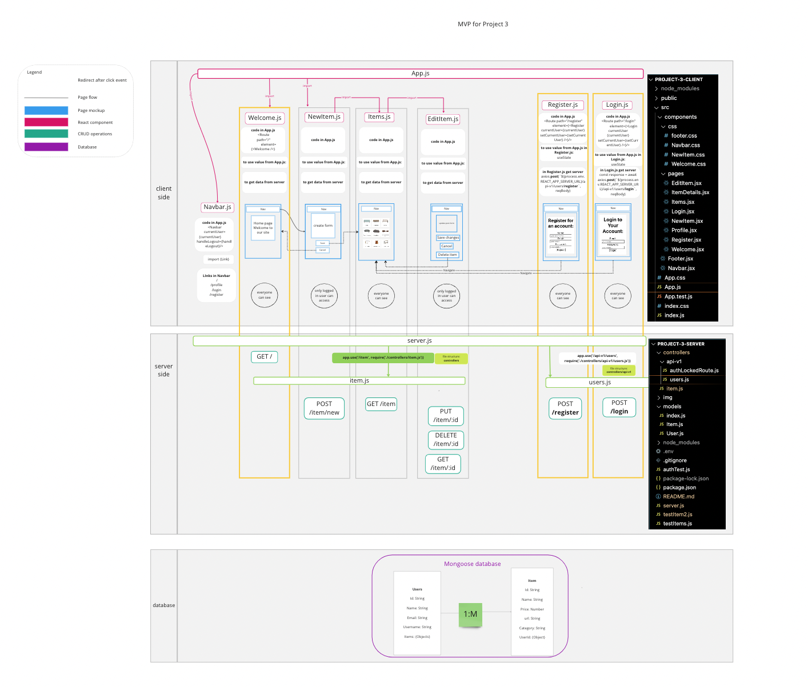
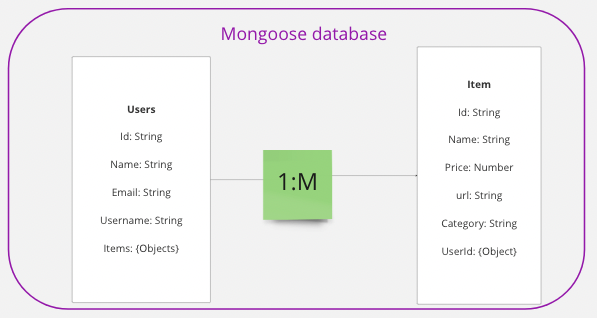

## MERN Mavericks

## Pitch
The MERN Mavericks(a.k.a Massive Engineer Residential Nature) is a website designed to organize and plan out the homes of new homeowners. The app lets you easily create, edit, and share videos of your reviews you've created on youTube. With a sleek and user-friendly design, finding and sharing videos has never been easier. Built with cutting-edge technologies like Bulma, React, Node.js, and MongoDB, our app is fast, reliable, and secure. Whether you're a creator or a spectator, come join the revolution and experience the future of video sharing today! 

# See deployed site here
 https://stellular-horse-44ede4.netlify.app/ 

# Approach taken
The MERN Mavericks took a collaborative approach in creating our video sharing app, utilizing the benefits of peer programming. This approach involved working together as a team to write code and share knowledge, with each team member contributing their own unique skills and perspectives. 
To help outline and track our progress, we utilized a Miro board to keep everyone in the loop on our plans for the app. This allowed us to easily visualize our progress and make adjustments as needed. 
We also implemented a CRUD system, dividing the work amongst the team members to ensure that each portion was completed efficiently and effectively. This allowed us to make use of each team member's strengths and expertise. 
Additionally, we utilized a Git workflow and learned from any Git conflicts we experienced, ensuring a smooth and organized development process. This allowed us to maintain a clear history of changes made to our codebase and collaborate efficiently. 
Breaking down problems into simple steps and communicating constantly were key to our success. We made sure to keep each other informed and share any challenges or questions, ensuring that everyone was on the same page. 
Most importantly, we approached this project as a learning opportunity. We learned together, had fun, and built a fantastic app as a result of our teamwork and collaboration. It was a great experience that brought us closer as a team and improved our skills as developers. 

# Explanations of technologies used
The MERN Mavericks have utilized some of the most cutting-edge technologies in the development of our video sharing app. Let me break down what each of these technologies do and why we chose to use them: 
Bulma: This is a modern CSS framework that provides a clean and responsive design for our app. It makes it easy to create visually appealing and user-friendly pages.
React: React is a popular JavaScript library for building user interfaces. It allows us to build interactive and dynamic pages for our app, making it easy for users to share and discover videos. 
Node.js: This is a powerful JavaScript runtime environment that we used for the server-side of our app. It allows us to handle all the back-end operations like storing and retrieving data, processing requests, and serving content to our users. 
MongoDB: This is a popular NoSQL database that we used to store all the data for our app. It provides fast and efficient storage and retrieval of data, making it the perfect choice for our needs. 
Express: Express is a popular Node.js framework that we used to build the back-end of our app. It provides a simple and flexible way to create APIs and handle HTTP requests, making it easy to manage all the data for our app. 

# installation instructions for any dependencies
Fork and clone this repo 
npm i to install all the necessary dependancies  

# technical diagram/Wireframe

## ERD

## Restful Routing Charts

| URL            | CRUD   | HTTP verb | Example            |
|:-------------- | ------ |:--------- |:-------------------|
| /user/login    | POST   | CREATE    | login existing user|
| /user/register | POST   | CREATE    | create new user    |
| /item/new      | POST   | CREATE    | create one item    |
| /item          | READ   | GET       | loads all items    |
| /item/:id      | PUT    | UPDATE    | update one item    |
| /item/:id      | DELETE | DESTROY   | destroy one item   |

## User Stories (MVP)
* As a user I want to see a list of items
* As a user I want to create items for my page
* As a user I want to edit, delete my items

## MVP Goals
* Use the MERN stack
* Provide the users an ability to CRUD
* Display the list of housewares for users to gain inspiration
* Deployed website online

## Stretch Goals
* Allow user to sort items by category and date entered
* Add ability to favorite an item
* Allow user to see all their favorites
* Allow user to associate multiple categories to an item
* Add visually appealing styling
* Add ability to provide product reviews
* Embed websites in the product cards (npm react-iframe)
* Show images on product cards
* Add search bar functionality
# Post project reflection 
Our video sharing app project was a great success, and we are proud of what we have accomplished as a team. Looking back, here are some of the key reflections on our project:
* Effective collaboration: Peer programming and constant communication were essential to our success. By working together and dividing tasks amongst the team, we were able to make efficient progress and produce a high-quality app. 
* Utilization of modern technologies: Using Bulma, React, Node.js, MongoDB, and Express allowed us to create a visually appealing, interactive, and efficient platform for our users. We are proud to have utilized some of the latest technologies in the development of our app. 
* Learning experience: The project was not just about building an app, but also a learning experience for all of us. We faced challenges and solved problems together, and we came out of the project with a stronger understanding of our skills and a better appreciation for each other's strengths. 
* User-focused design: Our focus on the needs and wants of our users was central to our success. By understanding what they wanted in a video sharing platform, we were able to build an app that truly met their needs and exceeded their expectations. 
In conclusion, the MERN Mavericks are proud of what we have accomplished and grateful for the opportunity to work on this project. We learned a lot and had fun, and we are confident that our users will love the app we have built. 

# Descriptions of any unsolved problems or major hurdles your team had to overcome
Styling the app: One major challenge in styling the app is ensuring consistency across different pages and devices while also making it visually appealing. This requires a deep understanding of CSS, HTML, and design principles, as well as the ability to write clean, maintainable code. 

Positioning of things on the page: Another challenge is getting elements to appear where they should on the page, especially when it comes to different screen sizes and resolutions. This requires a good understanding of layout, as well as the ability to use CSS Flexbox and Grid effectively. 

Responsiveness: Ensuring that the app looks good and functions properly on a wide range of devices and screen sizes can be a major hurdle. This requires a good understanding of responsive design, as well as the ability to use media queries and viewport units to create flexible and adaptive layouts. 

Git Workflow: Git is a powerful tool for managing code and tracking changes, but it can be challenging to use effectively. Some common hurdles include managing multiple branches, resolving merge conflicts, and ensuring that the entire team is working off of the same version of the codebase. A clear Git workflow, with well-defined processes for branching, merging, and version control, is essential for efficient and effective collaboration. 

